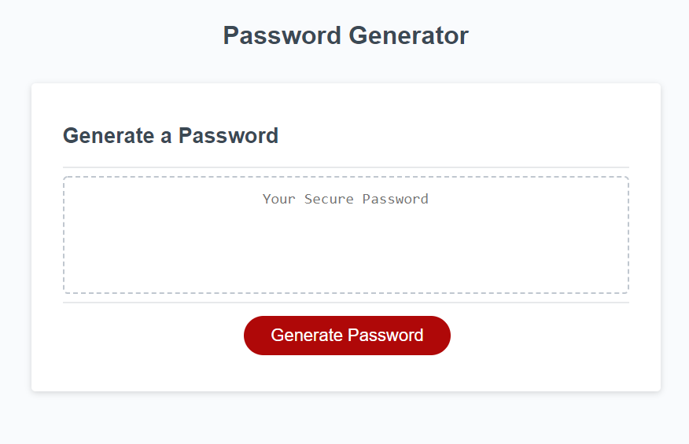

# Password Generator
That's right! In today's modern world there are so many hackers trying to infiltrate your accounts.
But how do we defend ourselves? With this swanky password generator!!!

## How Does It Work?
Using the sweet sweet power of javascript a random string of characters is generated bespoke for you and your needs!
Need a 125 character long string of letters, numbers and special characters? No problem! Need 8 characters of just lowercase letters? Um, that's not very secure, but okay!
The helpful prompt system asks you what kind characters you'd like to use and then asks for your string length and then PRESTO! You've got yourself a brand spanking new generated password.

## Link to Main
https://davebloisesquire.github.io/PassWordGen/

## Screen Shots

## Additional Notes
I didn't care for the prompt based system, I thought a series of form inputs would be more intuitive, but I didn't want to go off book for the assignment.
If you'd like to see a build with checkboxes and number inputs, check out my checkbox branch. It's done and tested, I just didn't implement it on the main page. Like I say, I didn't want to deviate too far from the assignment. But I like that version better myself. So I left a link to it at the bottom of the page. Or it's here https://davebloisesquire.github.io/PassWordGen/inputsPassGen

